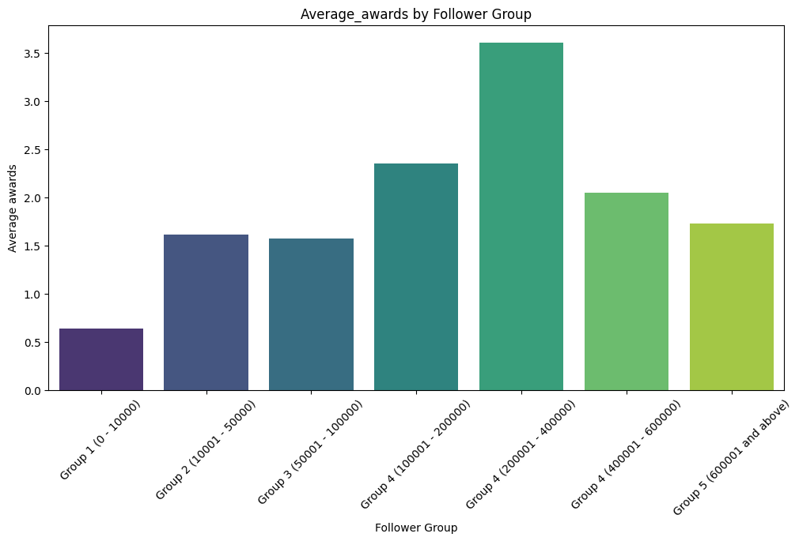
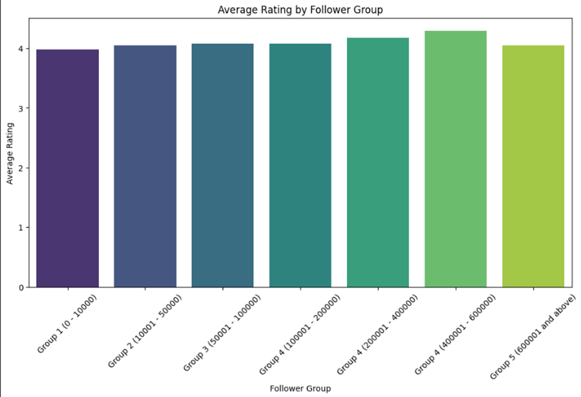
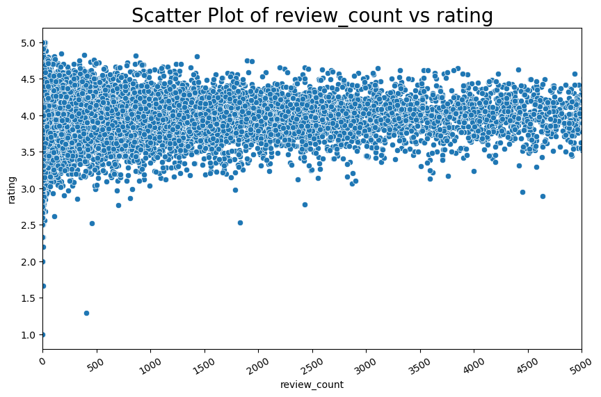

# Dự đoán Rating của Một Cuốn Sách

Dự án khoa học dữ liệu dự đoán **điểm rating trung bình** của sách từ dữ liệu Goodreads. Pipeline gồm: **thu thập dữ liệu** → **xử lý/chuẩn hóa** → **trực quan hóa** → **huấn luyện** (Linear Regression, SVR, MLP) → **đánh giá**. Ứng dụng: hỗ trợ quyết định nhập hàng/marketing, gợi ý sản phẩm.

## Mục lục

- [Giới thiệu & Mục tiêu](#giới-thiệu--mục-tiêu)
- [Cấu trúc thư mục](#cấu-trúc-thư-mục)
- [Dữ liệu & Thu thập](#dữ-liệu--thu-thập)
- [Tiền xử lý & Chuẩn hóa](#tiền-xử-lý--chuẩn-hóa)
- [Trực quan hóa](#trực-quan-hóa)
- [Mô hình & Đánh giá](#mô-hình--đánh-giá)
- [Cài đặt](#cài-đặt)
- [Nhóm thực hiện](#nhóm-thực-hiện)

---

## Giới thiệu & Mục tiêu

- **Bài toán**: dự đoán `rating` trung bình (giá trị liên tục) của mỗi cuốn sách.
- **Ý nghĩa**: hỗ trợ quản lý danh mục, tối ưu marketing, cải thiện trải nghiệm khách hàng, gợi ý sách cho người dùng.

## Cấu trúc thư mục

```
Project_Predict_Rate_Of_Book/
├─ Collection_Data/   # Thu thập link danh mục/link sách; lấy HTML chi tiết từng sách,
├─ Process_data/      # Dữ liệu
├─ Documents/         # Báo cáo, hình vẽ minh họa
└─ Demo/              # Làm sạch, chuẩn hóa, rút trích đặc trưng; tạo dataset huấn luyện, minh họa dự đoán/inference với mô hình đã huấn luyện
```

## Dữ liệu & Thu thập

Nguồn: **Goodreads** (trang sách với title, author, publisher, date, genres, mô tả, đánh giá/nhận xét…). Có thể lấy qua **API** hoặc **phân tích HTML**.

Quy trình thu thập (HTML parsing):

1. Lấy các **danh mục** (ví dụ: Recent updates/Listopia) → thu link danh mục.
2. Từ mỗi danh mục, **lấy link từng cuốn sách**.
3. Khử trùng link, sau đó **tải HTML** chi tiết mỗi sách (requests) và **trích xuất** bằng BeautifulSoup.

**Các trường dữ liệu chính** (ví dụ):
`id`, `title`, `link`, `series`, `author`, `author_link`, `rating_count`, `review_count`, `number_of_pages`, `date_published`, `publisher`, `original_title`, `genre_and_votes`, `isbn`, `isbn13`, `settings`, `characters`, `description`, `awards`, `rating`, `followers`.

> **Đầu ra khuyến nghị**:
> `Process_data/` – CSV link danh mục, link sách, và bảng chi tiết từng sách.

## Tiền xử lý & Chuẩn hóa

Thực hiện trong Jupyter/Python (pandas): đọc các file, kiểm tra kiểu dữ liệu/thiếu dữ liệu/giá trị duy nhất; loại trùng; ép kiểu; loại cột quá nhiễu; thay NaN hợp lý.

## Trực quan hóa

Dùng matplotlib/seaborn để quan sát tương quan giữa đặc trưng (ví dụ: `rating_count`, `number_of_pages`, `year`, `genre`) và `rating` (biểu đồ cột, scatter, histogram…).

=> Average_awards by Follower Group: Số giải thưởng trung bình tăng theo follower và đạt đỉnh ở nhóm 200k–400k, sau đó giảm ở các nhóm cực lớn → mối quan hệ dương nhưng phi tuyến, có dấu hiệu bão hòa

=> Average Rating by Follower Group: Rating trung bình nhích lên khi follower tăng, cao nhất ở nhóm 400k–600k rồi giảm nhẹ trên 600k → follower liên quan đến chất lượng cảm nhận, nhưng tác động không mạnh và cũng bão hòa.

=> review_count vs rating: Khi review ít, rating dao động lớn (nhiều cực trị); khi review nhiều, rating tập trung quanh 3.5–4.5 → review_count chủ yếu tăng độ tin cậy/giảm phương sai của rating hơn là làm rating cao hơn.

## Mô hình & Đánh giá

### Mô hình

- **Linear Regression** – baseline đơn giản.
- **SVR (Support Vector Regression)** – tận dụng kernel để xử lý quan hệ phi tuyến.
- **MLP Regressor** – mạng nơ-ron nhiều lớp; linh hoạt nhưng dễ quá khớp nếu dữ liệu ít.

### Đánh giá

- Chỉ số: **MAE**, **MSE**, **R²**.
- So sánh giữa 3 mô hình theo cùng tập test; phân tích lỗi và đề xuất cải tiến (tinh chỉnh siêu tham số, thêm đặc trưng).

> **Bảng kết quả mẫu** (điền số liệu thực nghiệm của bạn):
>
> |           Mô hình | MAE | MSE | R²  |
> | ----------------: | :-: | :-: | :-: |
> | Linear Regression |  …  |  …  |  …  |
> |               SVR |  …  |  …  |  …  |
> |     MLP Regressor |  …  |  …  |  …  |

## Cài đặt

Yêu cầu: **Python 3.10+**

```bash
python -m venv .venv
# Windows: .venv\Scriptsctivate
# macOS/Linux:
source .venv/bin/activate

pip install -U pip wheel
pip install pandas numpy scikit-learn matplotlib seaborn beautifulsoup4 requests tqdm joblib
# (Tùy chọn) thêm vào requirements.txt cho tiện cài đặt
```

## Nhóm thực hiện

- **Nguyễn Thành Long**
- **Tô Phan Kiều Thương**
- **Lê Anh Tình**
